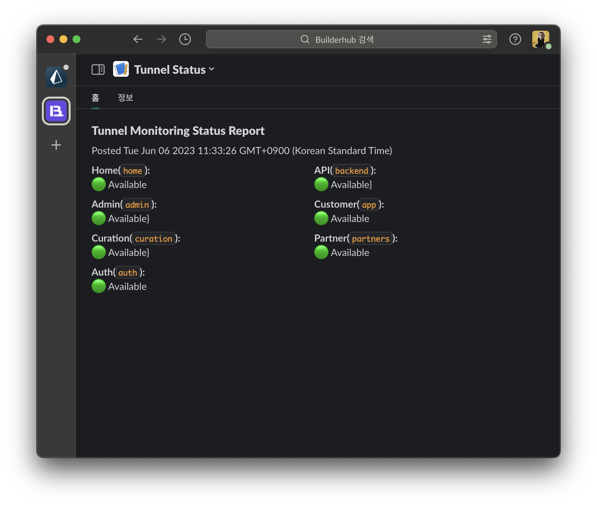

# @builderhub/localtunnel

[](https://github.com/builderhub-platform/localtunnel/actions/workflows/publish.yml)   [](https://opensource.org/licenses/MIT)

`@builderhub/localtunnel`은 로컬호스트를 전 세계에 노출하여 편리한 테스트 및 공유를 제공합니다! DNS를 건드리거나 배포할 필요 없이 로컬 변경 사항을 테스트할 수 있습니다.

원본은 [localtunnel](https://github.com/localtunnel/localtunnel)이지만 오랜기간 유지관리가 되지 않아 TypeScript로 재구성했습니다.

- [browserling](https://www.browserling.com/)과 같은 브라우저 테스트 도구나 [twilio](https://www.twilio.com)와 같은 외부 API 콜백 서비스와 함께 사용하기에 좋습니다. 이러한 서비스는 콜백을 위해 공개 URL을 요구합니다. 콜백 URL를 테스트를 할 수 있습니다.
- 각종 MSA를 로컬에서 터널로 구성하여 배포 된 것과 비슷한 SSL 환경에서 테스트해 볼 수 있습니다. 환경변수 `.env.tunnel` 방식으로 모든 MSA를 원하는 DNS로 테스트 합니다.

## Getting started

```
npx @builderhub/localtunnel --port 8000
```

## Installation

### Globally

```
npm install -g @builderhub/localtunnel
```

### As a dependency in your project

```
yarn add @builderhub/localtunnel
```

## CLI usage

localtunnel이 전역으로 설치된 경우 `lt` 명령을 사용하여 터널을 시작하세요.

```
lt --port 8000
```

실행하면 터널 서버에 연결하고 터널을 설정하며, 테스트에 사용할 URL을 알려줍니다. 이 URL은 세션이 유지되는 동안 활성 상태를 유지하므로, 이 시간동안 다른 사람과 공유하는 것이 가능합니다.

로컬 서버를 원하는 만큼 재시작할 수 있으며, `lt`는 이를 감지하고 다시 연결합니다

### Arguments

다음은 몇 가지 일반적인 argument 입니다. 추가 argument에 대해서는 `lt --help`를 참조하세요.

- `--subdomain` request a named subdomain on the localtunnel server (default is random characters)
- `--local-host` proxy to a hostname other than localhost

`env` 변수를 통해 argument를 지정할 수도 있습니다.

```
PORT=3000 lt
```

## API

`localtunnel` 클라이언트는 API를 통해서도 사용할 수 있습니다(테스트 통합, 자동화 등).

### localtunnel(port [,options][,callback])

지정된 로컬 `port`에 대한 새 로컬 터널을 만듭니다. 공개 localtunnel URL이 할당되면 해결되는 Promise를 반환합니다. `options`을 사용하여 특정 `subdomain`을 요청할 수 있습니다. `callback` 함수가 전달될 수 있으며, 이 경우 `Promise`를 반환하지 않습니다. 이전 노드 스타일 콜백 API와의 하위 호환성을 위해 존재합니다. 속성으로 `port`가 있는 단일 옵션 개체를 전달할 수도 있습니다.

```ts
import { localtunnel } from "@builderhub/localtunnel";

(async () => {
  const tunnel = await localtunnel({ port: 3000 });

  // the assigned public url for your tunnel
  // i.e. https://abcdefgjhij.tunnel.builderhub.io
  tunnel.url;

  tunnel.on("close", () => {
    // tunnels are closed
  });
})();
```

#### options

- `port` (number) [required] The local port number to expose through localtunnel.
- `subdomain` (string) Request a specific subdomain on the proxy server. **Note** You may not actually receive this name depending on availability.
- `host` (string) URL for the upstream proxy server. Defaults to `https://tunnel.builderhub.io`.
- `local_host` (string) Proxy to this hostname instead of `localhost`. This will also cause the `Host` header to be re-written to this value in proxied requests.
- `local_https` (boolean) Enable tunneling to local HTTPS server.
- `local_cert` (string) Path to certificate PEM file for local HTTPS server.
- `local_key` (string) Path to certificate key file for local HTTPS server.
- `local_ca` (string) Path to certificate authority file for self-signed certificates.
- `allow_invalid_cert` (boolean) Disable certificate checks for your local HTTPS server (ignore cert/key/ca options).

자세한 인증서 옵션은 [tls.createSecureContext](https://nodejs.org/api/tls.html#tls_tls_createsecurecontext_options)을 참조하세요.

### Tunnel

콜백에 반환된 `tunnel` 인스턴스는 다음 이벤트를 내보냅니다.

| event   | args | description                                                                          |
| ------- | ---- | ------------------------------------------------------------------------------------ |
| request | info | fires when a request is processed by the tunnel, contains _method_ and _path_ fields |
| error   | err  | fires when an error happens on the tunnel                                            |
| close   |      | fires when the tunnel has closed                                                     |

`tunnel` 인스턴스에는 다음과 같은 메서드가 있습니다.

| method | args | description      |
| ------ | ---- | ---------------- |
| close  |      | close the tunnel |

## Slack integration

하위 도메인을 여러 개발자가 함께 사용할 경우 충돌이 발생하여 나중에 터널을 요청하게 되면 랜덤한 하위 도메인을 제공합니다.

빌더허브 플랫폼 개발팀은 예약된 7개의 하위 도메인을 모니터링 합니다. 개발자는 Slack의 Tunnel Status 앱으로 확인한 후 터널 환경에서의 앱 테스트가 가능합니다.



## License

MIT
